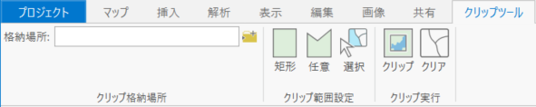
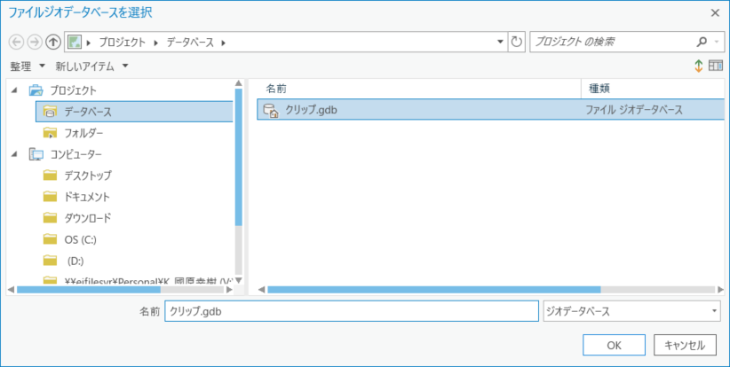
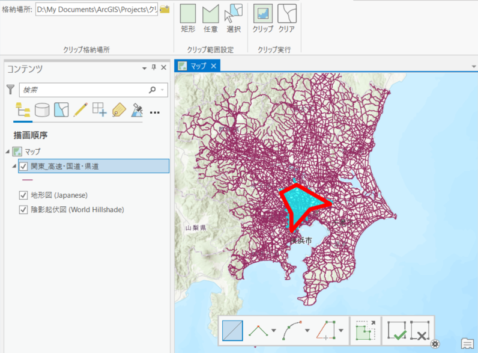
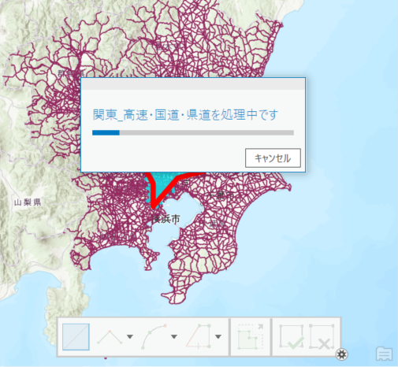
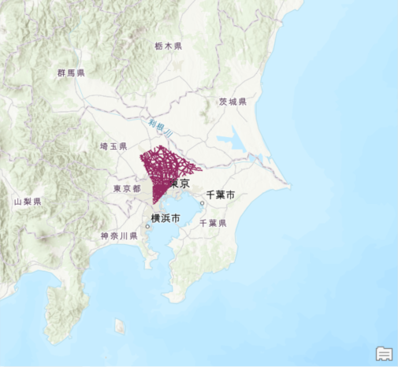

## クリップツール
クリップ範囲をスケッチ、もしくは、ポリゴンをクリックし、その範囲にあるフィーチャをクリップするツールです

## ツールの使い方
1.クリップツールタブを押下します。

2.クリップしたフィーチャの格納場所を指定します。

3.「矩形」「任意」「選択」ボタンのいずれかで、クリップする範囲を指定します。

4.「クリップ」ボタンを押下し、クリップを実行します。

5.対象範囲がクリップされます。

