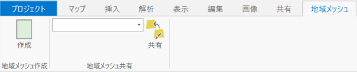
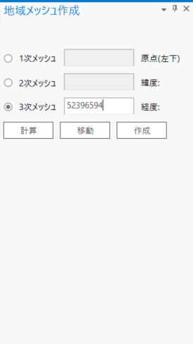
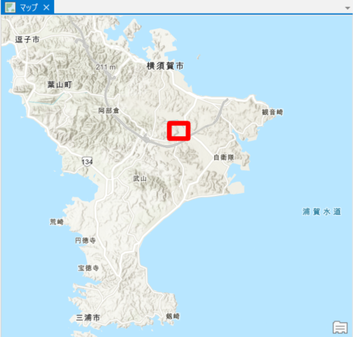
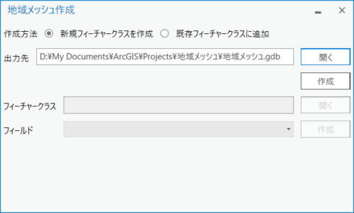
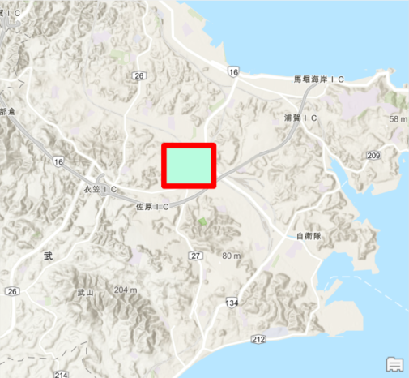
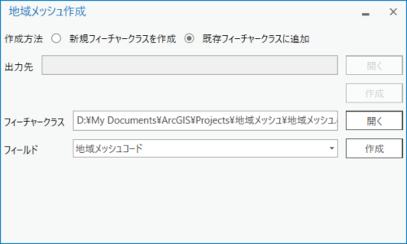
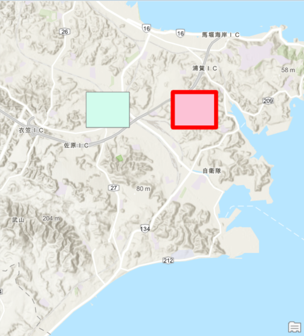
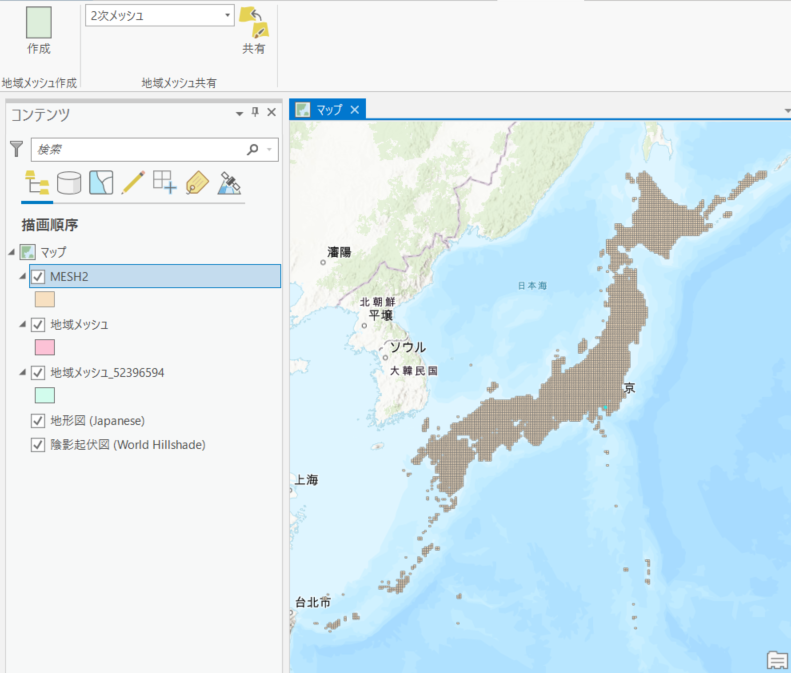

## 地域メッシュツール
[地域メッシュ](https://www.esrij.com/gis-guide/gis-other/mesh/)コードを入力し、入力した地域メッシュの位置を確認・作成することができるツールです。3 次メッシュまで対応しています。また、ESRIジャパンがArcGIS Online に公開している 2 次メッシュ～ 4 次メッシュを読み込む機能も付いています。

## ツールの使い方
1.地域メッシュ作成タブの「作成」ボタンを押下します

2.ドックパネルで地域メッシュコードを入力し、「計算」ボタンを押下します。

3.対象の地域メッシュが強調されます。「移動」ボタンを押下することによって、対象の地域メッシュに移動することができます。

4.「作成」ボタンを押下すると、地域メッシュ作成画面に遷移します。

5.「新規フィーチャークラスを作成」を選択すると対象の地域メッシュをフィーチャクラスとして出力します。

6.「既存フィーチャークラスに追加」の場合は対象のフィーチャクラスと地域メッシュコードを格納するフィールドを選択してください。

7.対象の地域メッシュを既存のフィーチャクラスに新規登録します。

8.また、地域メッシュの共有ボタンを押下することによって、ESRIジャパンがArcGIS Online に公開している 2 次メッシュ～ 4 次メッシュを読み込むことができます。

